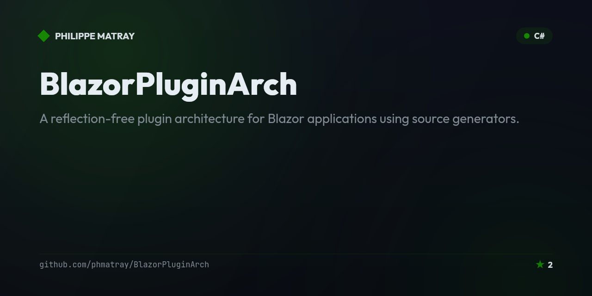

# Blazor Plugin Architecture

<!-- portfolio-badges:start -->
<!-- Identity -->
[](https://github.com/phmatray/BlazorPluginArch)

[](https://github.com/phmatray/BlazorPluginArch/stargazers)
[](https://github.com/phmatray/BlazorPluginArch/network/members)

<!-- Activity -->
[](https://github.com/phmatray/BlazorPluginArch/issues)
[](https://github.com/phmatray/BlazorPluginArch/pulls)
[](https://github.com/phmatray/BlazorPluginArch/commits)
<!-- portfolio-badges:end -->


A reflection-free plugin architecture for Blazor applications using source generators.

## Features

- **Compile-time plugin discovery** — Roslyn source generators scan `IPlugin` implementations and `.razor` files at build time; there is no runtime assembly scanning.
- **AOT & trimming compatible** — because discovery happens at compile time, plugins work with Native AOT and trimming, unlike reflection-based approaches.
- **Simple plugin contract** — implement `IPlugin` (`Id`, `Name`, `Version`, `Description`, `Initialize`) and optionally `IPluginServiceRegistrar` to register DI services.
- **Automatic route & component discovery** — `@page` directives in a plugin's `.razor` files are found automatically and exposed through `IPluginRegistry`.
- **`[PluginComponent]` customization** — an optional attribute to control `DisplayName`, `Order`, and `ShowInNavigation` per component, with sensible PascalCase-derived defaults.
- **Inspectable generated code** — each plugin ships a generated `PluginRegistration.GetPlugins()` class the host references directly, so removing a plugin is a compile-time error, not a silent runtime gap.
- **Sample plugin included** — `BlazorPluginArch.SamplePlugin` demonstrates a complete, working plugin end-to-end.

## The Problem

Building modular Blazor applications typically requires one of these approaches:

1. **Reflection-based discovery**: Scanning assemblies at runtime to find components and services. This is slow, breaks AOT compilation, and makes it harder to reason about what's loaded.

2. **Manual registration**: Explicitly registering every component, route, and service. This is tedious, error-prone, and creates tight coupling between the host and plugins.

3. **MEF/MAF frameworks**: Heavy dependency on complex frameworks that add overhead and learning curve.

None of these solutions provide a clean, performant, compile-time-safe way to build plugin-based Blazor applications.

## The Solution

This architecture uses **Roslyn source generators** to discover plugins and components at **compile time**, eliminating reflection entirely. The result is:

- **Zero runtime reflection** - Everything is known at compile time
- **AOT compatible** - Works with Native AOT and trimming
- **Type-safe** - Compile-time errors if something is misconfigured
- **Simple API** - Just implement an interface and add attributes
- **Automatic discovery** - Components are found by scanning `.razor` files

## Architecture Overview

```
┌─────────────────────────────────────────────────────────────────────┐
│                         Host Application                             │
│  ┌─────────────────────────────────────────────────────────────┐   │
│  │ Program.cs                                                    │   │
│  │   builder.Services.AddPlugins(                               │   │
│  │       PluginA.Generated.PluginRegistration.GetPlugins(),     │   │
│  │       PluginB.Generated.PluginRegistration.GetPlugins()      │   │
│  │   );                                                          │   │
│  └─────────────────────────────────────────────────────────────┘   │
│  ┌─────────────────────────────────────────────────────────────┐   │
│  │ Routes.razor                                                  │   │
│  │   <Router AdditionalAssemblies="PluginRegistry.Assemblies">  │   │
│  └─────────────────────────────────────────────────────────────┘   │
└─────────────────────────────────────────────────────────────────────┘
        │                              │
        ▼                              ▼
┌───────────────────┐      ┌───────────────────┐
│    Plugin A       │      │    Plugin B       │
│  ┌─────────────┐  │      │  ┌─────────────┐  │
│  │ MyPlugin.cs │  │      │  │ MyPlugin.cs │  │
│  │ : IPlugin   │  │      │  │ : IPlugin   │  │
│  └─────────────┘  │      │  └─────────────┘  │
│  ┌─────────────┐  │      │  ┌─────────────┐  │
│  │ Pages/*.razor│ │      │  │ Pages/*.razor│ │
│  │ @page "/x"  │  │      │  │ @page "/y"  │  │
│  └─────────────┘  │      │  └─────────────┘  │
│         │         │      │         │         │
│         ▼         │      │         ▼         │
│  ┌─────────────┐  │      │  ┌─────────────┐  │
│  │  Generated  │  │      │  │  Generated  │  │
│  │ Registration│  │      │  │ Registration│  │
│  └─────────────┘  │      └──┴─────────────┴──┘
└───────────────────┘
```

## Project Structure

```
BlazorPluginArch/
├── BlazorPluginArch.Abstractions/     # Plugin contracts (shared)
│   ├── IPlugin.cs                     # Main plugin interface
│   ├── IPluginRegistry.cs             # Registry for accessing plugins
│   ├── IPluginServiceRegistrar.cs     # Optional: register DI services
│   ├── PluginComponentAttribute.cs    # Optional: customize components
│   ├── PluginInfo.cs                  # Plugin metadata
│   └── PluginExtensions.cs            # DI registration helpers
│
├── BlazorPluginArch.SourceGenerators/ # Compile-time code generation
│   └── PluginSourceGenerator.cs       # Discovers plugins & components
│
├── BlazorPluginArch.SamplePlugin/     # Example plugin
│   ├── SamplePlugin.cs                # Plugin implementation
│   └── Components/Pages/              # Razor components
│       ├── SamplePage.razor
│       └── AboutPlugin.razor
│
└── BlazorPluginArch/                  # Host application
    ├── Program.cs                     # Registers plugins
    └── Components/
        └── Routes.razor               # Includes plugin assemblies
```

## How It Works

### 1. Source Generator Scans Plugins

When you build a plugin project, the source generator:

1. Finds all classes implementing `IPlugin`
2. Scans all `.razor` files for `@page` directives
3. Parses optional `[PluginComponent]` attributes for customization
4. Generates a `PluginRegistration` class with all metadata

### 2. Generated Code (No Reflection)

The source generator produces code like this:

```csharp
// Auto-generated in each plugin assembly
namespace MyPlugin.Generated;

public static class PluginRegistration
{
    public static IEnumerable<PluginInfo> GetPlugins()
    {
        var plugin = new MyPlugin();

        yield return new PluginInfo
        {
            Id = plugin.Id,
            Name = plugin.Name,
            Version = plugin.Version,
            Assembly = typeof(MyPlugin).Assembly,
            Instance = plugin,
            Components = new List<PluginComponentInfo>
            {
                new() { ComponentType = typeof(MyPage), Route = "/my-page", ... },
                new() { ComponentType = typeof(Settings), Route = "/settings", ... }
            }
        };
    }
}
```

### 3. Host Aggregates Plugins

The host application explicitly references each plugin's generated registration:

```csharp
builder.Services.AddPlugins(
    MyPlugin.Generated.PluginRegistration.GetPlugins(),
    AnotherPlugin.Generated.PluginRegistration.GetPlugins()
);
```

This is **compile-time safe** - if a plugin is removed, you get a build error.

## Creating a Plugin

### Step 1: Create a Razor Class Library

```bash
dotnet new razorclasslib -n MyPlugin
```

### Step 2: Add Project References

```xml
<ItemGroup>
    <ProjectReference Include="..\BlazorPluginArch.Abstractions\BlazorPluginArch.Abstractions.csproj" />
    <ProjectReference Include="..\BlazorPluginArch.SourceGenerators\BlazorPluginArch.SourceGenerators.csproj"
                      OutputItemType="Analyzer"
                      ReferenceOutputAssembly="false" />
</ItemGroup>

<!-- Required: Pass .razor files to source generator -->
<ItemGroup>
    <AdditionalFiles Include="**\*.razor" />
</ItemGroup>
```

### Step 3: Implement IPlugin

```csharp
using BlazorPluginArch.Abstractions;

namespace MyPlugin;

public class MyPlugin : IPlugin
{
    public string Id => "my-plugin";
    public string Name => "My Plugin";
    public string Version => "1.0.0";
    public string? Description => "Does amazing things";

    public void Initialize()
    {
        // Called when plugin is loaded
    }
}
```

### Step 4: Create Razor Components

```razor
@page "/my-feature"
@attribute [PluginComponent(DisplayName = "My Feature", Order = 10)]

<h1>My Feature</h1>
<p>This page is provided by MyPlugin.</p>
```

The `[PluginComponent]` attribute is **optional**. Without it:
- `DisplayName` defaults to the filename split by PascalCase ("MyFeature" → "My Feature")
- `Order` defaults to 100
- `ShowInNavigation` defaults to true

### Step 5: Register Services (Optional)

```csharp
public class MyPlugin : IPlugin, IPluginServiceRegistrar
{
    // ... IPlugin members ...

    public void RegisterServices(IServiceCollection services)
    {
        services.AddScoped<IMyService, MyService>();
    }
}
```

## Using Plugins in the Host

### Program.cs

```csharp
using BlazorPluginArch.Abstractions;
using MyPlugin.Generated;
using AnotherPlugin.Generated;

var builder = WebApplication.CreateBuilder(args);

builder.Services.AddRazorComponents()
    .AddInteractiveServerComponents();

// Register all plugins
builder.Services.AddPlugins(
    MyPlugin.Generated.PluginRegistration.GetPlugins(),
    AnotherPlugin.Generated.PluginRegistration.GetPlugins()
);

var app = builder.Build();

// Required: re-execute on 404 so the Blazor Router can resolve plugin routes
app.UseStatusCodePagesWithReExecute("/not-found", createScopeForStatusCodePages: true);

app.UseHttpsRedirection();
app.UseAntiforgery();

app.MapStaticAssets();
app.MapRazorComponents<App>()
    .AddInteractiveServerRenderMode();

app.Run();
```

### NotFound Page (Required)

You **must** create a `NotFound.razor` page and configure the Router to use it. Without this, navigating directly to plugin routes (e.g. via URL or page refresh) will return a raw 404 instead of letting the Blazor Router resolve routes from plugin assemblies.

**`Components/Pages/NotFound.razor`**:

```razor
@page "/not-found"
@layout MainLayout

<h3>Not Found</h3>
<p>Sorry, the content you are looking for does not exist.</p>
```

### Routes.razor

The `NotFoundPage` parameter on the `Router` component is **required** for plugin routes to work correctly:

```razor
@using BlazorPluginArch.Abstractions
@inject IPluginRegistry PluginRegistry

<Router AppAssembly="typeof(Program).Assembly"
        AdditionalAssemblies="PluginRegistry.PluginAssemblies"
        NotFoundPage="typeof(Pages.NotFound)">
    <Found Context="routeData">
        <RouteView RouteData="routeData" DefaultLayout="typeof(MainLayout)"/>
        <FocusOnNavigate RouteData="routeData" Selector="h1"/>
    </Found>
</Router>
```

### Building Navigation from Plugins

```razor
@inject IPluginRegistry PluginRegistry

<nav>
    @foreach (var component in PluginRegistry.NavigationComponents)
    {
        <a href="@component.Route">@component.DisplayName</a>
    }
</nav>
```

## API Reference

### IPlugin

```csharp
public interface IPlugin
{
    string Id { get; }           // Unique identifier
    string Name { get; }         // Display name
    string Version { get; }      // Semantic version
    string? Description { get; } // Optional description
    void Initialize();           // Called on startup
}
```

### IPluginServiceRegistrar

```csharp
public interface IPluginServiceRegistrar
{
    void RegisterServices(IServiceCollection services);
}
```

### IPluginRegistry

```csharp
public interface IPluginRegistry
{
    IReadOnlyList<PluginInfo> Plugins { get; }
    IReadOnlyList<Assembly> PluginAssemblies { get; }
    IReadOnlyList<PluginComponentInfo> NavigationComponents { get; }
    PluginInfo? GetPlugin(string id);
}
```

### PluginComponentAttribute

```csharp
[PluginComponent(
    DisplayName = "My Page",     // Navigation label
    Order = 10,                  // Sort order (lower = first)
    ShowInNavigation = true      // Include in nav menus
)]
```

## Benefits

| Aspect | Traditional (Reflection) | This Architecture |
|--------|-------------------------|-------------------|
| Discovery | Runtime scanning | Compile-time generation |
| Performance | Slower startup | No overhead |
| AOT Support | Breaks trimming | Fully compatible |
| Type Safety | Runtime errors | Compile-time errors |
| Debugging | Hard to trace | Clear generated code |

## Limitations

- Plugins must be **referenced at compile time** - no dynamic loading of unknown assemblies
- Each plugin needs the source generator reference in its `.csproj`
- Adding/removing plugins requires recompilation of the host

## When to Use This

**Good fit:**
- Modular monoliths with known plugin set
- Applications requiring AOT compilation
- Teams wanting compile-time safety
- Performance-critical applications

**Not ideal for:**
- Dynamic plugin loading at runtime
- User-installable plugins
- Scenarios requiring hot-reload of plugins

<!-- portfolio-techstack:start -->

## Tech Stack

- **.NET 10 · .NET Standard 2.0**
- Microsoft.AspNetCore.Components
- Microsoft.JSInterop
- Microsoft.AspNetCore.Components.Web
- Microsoft.CodeAnalysis.CSharp

<!-- portfolio-techstack:end -->

## License

MIT

---

## Roadmap

- [ ] Support dynamic plugin loading behind an opt-in (non-AOT) mode
- [ ] Add versioning/compatibility checks between host and plugin contracts
- [ ] Provide a `dotnet new` template for scaffolding new plugins
- [ ] Add a sample for lazy-loaded Blazor WebAssembly plugin assemblies
- [ ] Expand test coverage for the source generator's edge cases

Track progress and proposals in the [open issues](https://github.com/phmatray/BlazorPluginArch/issues).

<!-- portfolio-sections:start -->

## Contributing

Contributions are welcome. Open an issue first to discuss any significant change.

1. Fork the repository and create your branch (`git checkout -b feat/my-feature`)
2. Commit your changes (`git commit -m 'feat: ...'`)
3. Push the branch and open a Pull Request

<!-- portfolio-sections:end -->
